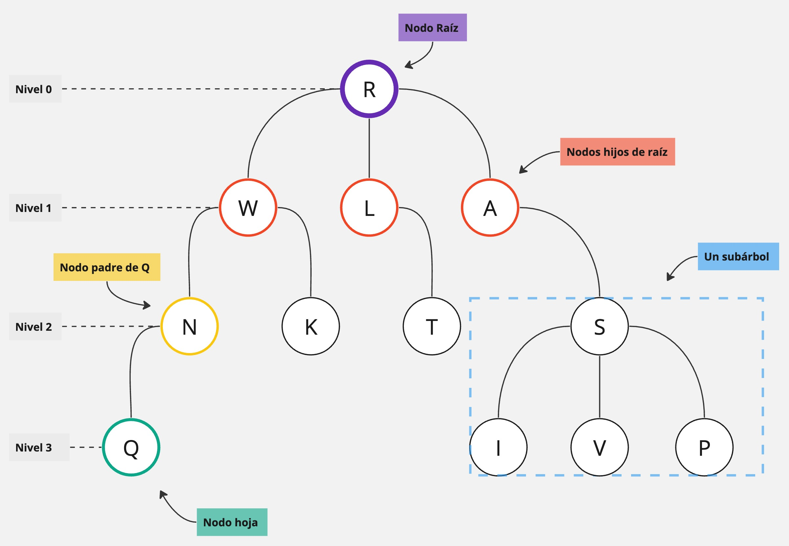
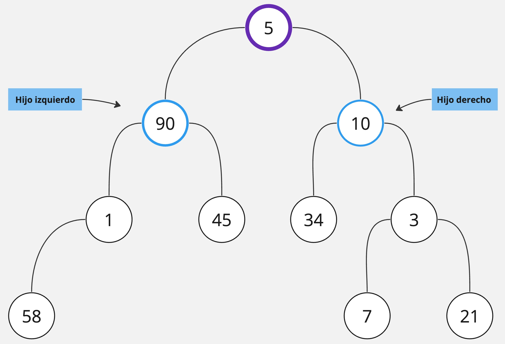
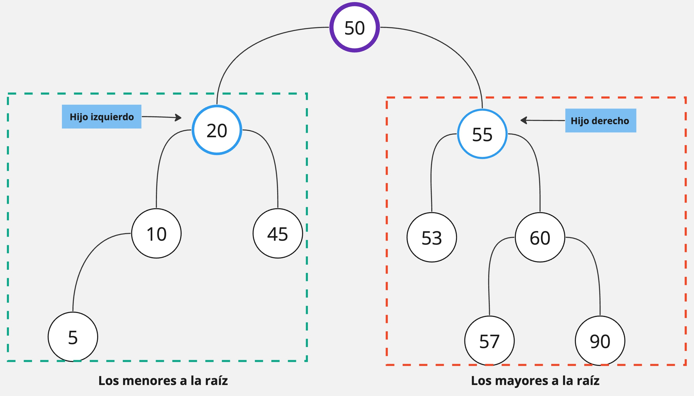

# TDA ABB

## Repositorio de Lucas Martín Areco Gonzalez - 111203 - lareco@fi.uba.ar

- Para compilar:

```bash
make pruebas_alumnno
```

- Para ejecutar:

```bash
./pruebas_alumno
```

- Para ejecutar con valgrind:
```bash
make valgrind-alumno
```

---
##  Árboles...
<div text-aling="justify">
 
### Árbol

Un árbol es una estructura formada por un conjunto nodos, donde cada nodo puede tener múltiples conexiones con otros nodos. Cada uno de los nodos tiene un rol de acuerdo a su posición en el árbol. El nodo raíz es el primer nodo del árbol. Un nodo padre es aquel que esta inmediatemente conectado superiormente a otro nodo. Al mismo tiempo, aquellos nodos que estan inmediatamente conectados inferiormente a un nodo padre, se llamaran nodos hijos. Por último, los nodos que estan al final del árbol, que no tienen hijos y por lo tanto no pueden ser padres, se denominan nodos hoja. Esta disposición jerárquica de los nodos en el árbol implica la existencia de k niveles (Nk) , que indican la distancia de cada nodo respecto a la raíz. 

Al mismo tiempo, podemos ver que este TDA tiene una estructura de naturaleza recursiva. Si nos enfocamos en cualquier nodo tendremos un subárbol, donde el nodo enfocado es considerado la raiz del subárbol que estará conectada sus hijos. 

<div align="center">

</div>

### Árbol Binario
Más allá de la estructura general de un árbol, existen tipos específicos de árboles. Uno de ellos es el árbol binario (AB). Lo interesante de este árbol es que vamos a tener noción de izquierda y derecha si nos enfocamos en un nodo. Cada nodo va a tener como máximo dos hijos. Uno de los hijos va a ser el izquierdo y el otro el derecho. 

La operación más importante con el AB es recorrerlo, ya que lo que se busca es optimizar la busqueda de elementos. Existen varias formas de recorrerlo pero las más destacables son:

- Preorden (NID): se caracteriza por visitar primero el nodo actual (N), luego el hijo izquierdo (I), y finalmente el hijo derecho (D). Este enfoque garantiza que cada nodo sea visitado antes de sus descendientes.

- Inorder (IND): primero se visita el nodo izquierdo (I), luego el nodo actual (N), y finalmente el nodo derecho (D). De esta forma los nodo del árbol se visitan en orden ascendente.

- Postorder (NDI): visita primero el hijo izquierdo (N), luego el hijo derecho (D), y finalmente el nodo actual (I). Así los hijos se visitan antes que el padre.

<div align="center">

</div>

### Árbol Binario de Búsqueda
Ahora bien, con un AB todavía resulta difícil la búsqueda de elementos ya que no están ordenados bajo ninguna regla. Debido a esto se presenta el árbol binario de búsqueda (ABB). 

En nuestro Árbol de Búsqueda Binaria (ABB), vamos a encontrar una estructura igual al AB pero cada nodo sigue una regla simple: el hijo izquierdo siempre tiene un valor menor que su nodo padre, y el hijo derecho tiene un valor mayor. Esta regla ordena automáticamente los elementos en el árbol, facilitando la búsqueda de cualquier valor dentro de la estructura. Por otro lado, debemos ser cuidadosos a la hora de insertar elementos ya que deben seguir la regla propuesta.

Con lo dicho anteriormente acerca de los subárboles en un árbol general, los subárboles de un ABB también son ABB.

Las principales operaciones que se pueden realizar en los árboles:
 - Crear
 - Buscar
 - Quitar
 - Insertar
 - Recorrer
 - Destruir


<div align="center">

</div>

En el árbol de ejemplo, si aplicamos los recorridos quedarían así:

- Preorder: [50, 20, 10, 5, 45, 55, 53, 60, 57, 90] Sirve para hacer una copia del ABB.
- Inorder: [5, 10, 20, 45, 50, 53, 55, 57, 60, 90] Obtenemos un recorrido ordenado del ABB (de menor a mayor).
- Postorder: [5, 10, 45, 20, 53, 57, 90, 60, 55, 50] Obtenemos el orden de borrado del ABB.


## Complejidades 

Ahora se analizan las principales operaciones que se pueden realizar con el ABB.

- **Busqueda, inserción y eliminación: O(log(n))**. Al descender por niveles en el árbol, descartamos ramas hasta llegar al elemento deseado para buscar, eliminar o insertar. Esta eficiencia se mantiene cuando el árbol está balanceado, ya que no necesitamos recorrer todos los elementos. Sin embargo, si el árbol no está balanceado, en el peor de los casos, la complejidad sería O(n), ya que se degeneraría en una lista de nodos enlazados. Por lo tanto, la mejora fundamental que ofrece el árbol esta en la eficiencia de búsqueda.
###
- **Creación y destrucción: O(1)**. No se debe recorrer nada, simplemente se ejecuta una instrucción.
###

###
- **Vacío y tamaño O(1)**. No se debe recorrer nada, simplemente se accede a los valores con una instrucción.
###

- **Recorrer: O(n)**. En todos los recorridos explicados anteriormente se visitan todos los elementos, se recorre todo el árbol.


## Implementación

La implementación del ABB se llevó a cabo utilizando recursividad en la mayoría de las funciones para aprovechar su naturaleza recursiva y para practicar este enfoque. Para lograr esto las funciones como `abb_quitar`, `abb_insertar` o `abb_buscar`, entre otras, llaman a funciones auxiliares que se encargan de realizar las operaciones. Esto permitió trabajar a partir de nodos y no del árbol en sí, siempre utilizando el nodo raíz. En el caso de quitar elementos, debido a que se requeria del predecesor inorder al elemento a eliminar, se implementó una función aparte obtenerlo.

La veces que se tenían que comparar dos elementos para tomar alguna decisión, se aprovecho el comparador que ya se proponía en la estructura del `abb_t`.

Para el iterador interno `abb_con_cada_elemento` se implementaron funciones auxiliares para cada uno de los recorridos (preorder, inorder y postorder) de manera recursiva. Esto fue de gran utilidad a la hora de implementar la función `abb_recorrer` ya que reutilizó el iterador interno y de esta forma los recorridos. Aún así, se debió implementar una función para pasarle al iterador interno que fue `completar_vector`. En relación al vector, para facilitar la implementación se creó un `struct vector_t` para poder manejar sus atributos. 


Por último, en `abb_destruir` se reutilizó la función `abb_destruir_todo` para simplificar el código.

</div>


